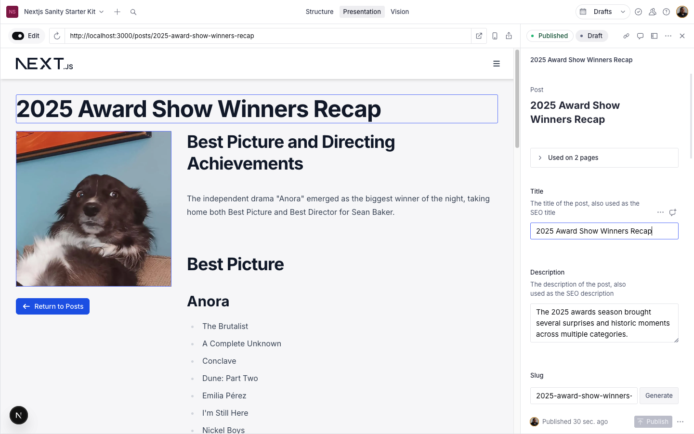
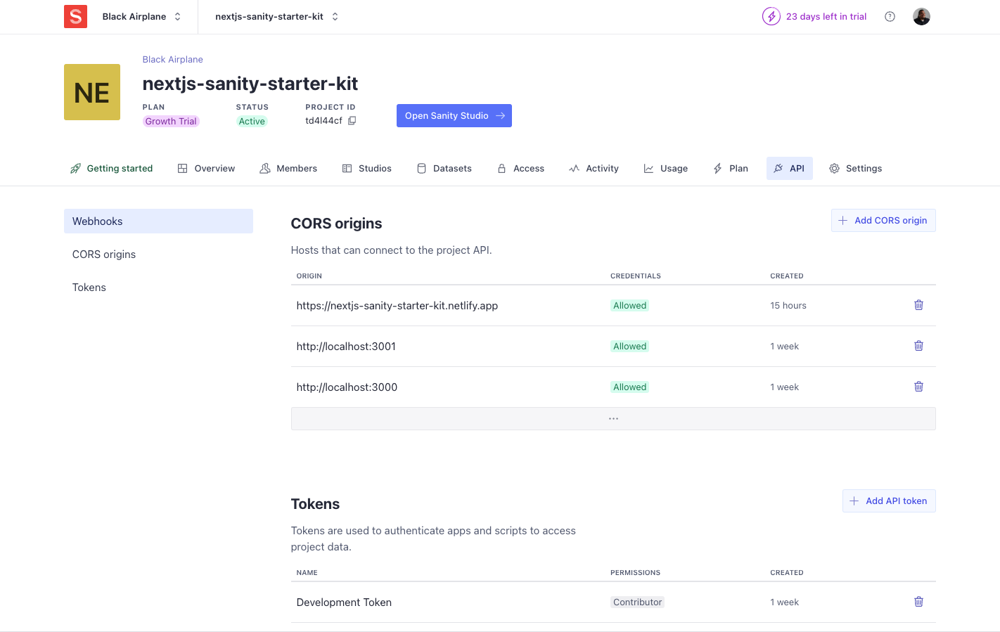
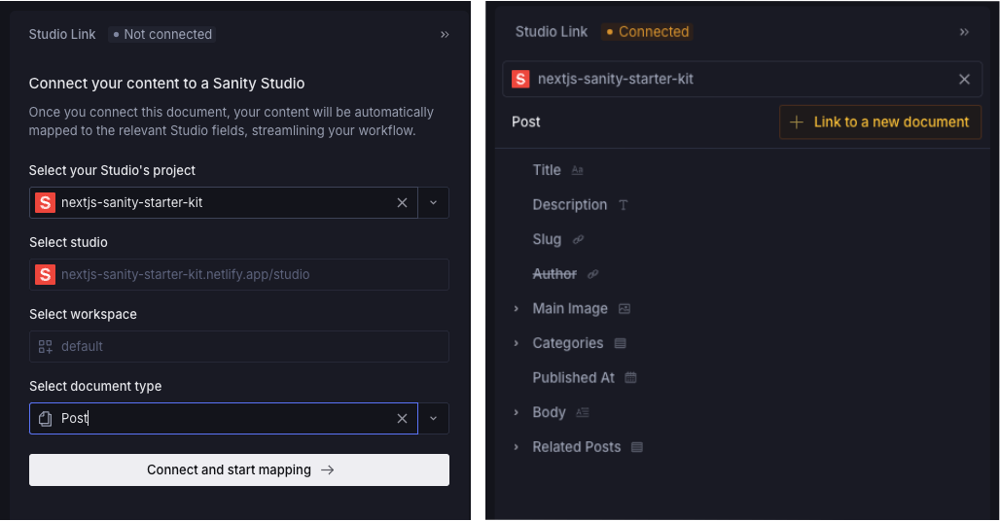

# Nextjs 16 App Router + Sanity Starter Kit



## Features

- Next.js - This is a [Next.js](https://nextjs.org/) project bootstrapped with [`create-next-app`](https://github.com/vercel/next.js/tree/canary/packages/create-next-app)
- Type checking [TypeScript](https://www.typescriptlang.org)
- Integrate with [Tailwind CSS v4](https://tailwindcss.com) and [Headless UI v2](https://headlessui.dev/)
- Linter with [ESLint](https://eslint.org)
- Code Formatter with [Prettier](https://prettier.io)
- [FontAwesome](https://fontawesome.com/icons) - Free Solid and Regular icon libraries
- [Sanity](https://www.sanity.io/) - Content managment system
  - Integrated Sanity Studio embeded in the Next js project
  - Configured for Presentation Mode and Live editing

### Requirements

[Node](https://nodejs.org/en/) 20.19.0 and npm
Recommend installing with [nvm](https://github.com/nvm-sh/nvm#installing-and-updating)

```shell
nvm install
nvm use
```
## Getting Started

You'll need a Sanity account as well as a Sanity project To get started. Requires `.env` variables.

```
NEXT_PUBLIC_BASE_URL="http://localhost:3000"
NEXT_PUBLIC_SANITY_STUDIO_URL="http://localhost:3000/studio"

NEXT_PUBLIC_SANITY_PROJECT_ID=""
NEXT_PUBLIC_SANITY_DATASET="production"

SANITY_API_READ_TOKEN=
```



You'll need a `projectId` and `apiToken` to get this up and running. Don't forget to add the CORS origin for localhost and the actual project URL. Once you spin up a project, remember to add `post` documents in Studio to test.

Then, run the development server:

```bash
npm run dev
# or
yarn dev
# or
pnpm dev
# or
bun dev
```

Open [http://localhost:3000](http://localhost:3000) with your browser to launch local dev.  
Open [http://localhost:3000/studio](http://localhost:3000/studio) to open local Sanity Studio.

You can start editing the page by modifying `app/(page)/page.tsx`. The page auto-updates as you edit the file.

This project uses [`next/font`](https://nextjs.org/docs/app/building-your-application/optimizing/fonts) to automatically optimize and load [Inter](https://fonts.google.com/specimen/Inter).

## Sanity Dashboard

The [Sanity Dashboard](https://www.sanity.io/docs/dashboard) is the central hub for your content operations. Here you'll find your deployed [studios](https://www.sanity.io/docs/studio), [custom apps](https://www.sanity.io/docs/app-sdk), and official Sanity apps like [Canvas](https://www.sanity.io/docs/canvas/canvas-user-guide) and [Media Library](https://www.sanity.io/docs/media-library) (*Media Library comes with higher tier plans).

### Canvas



Canvas is another UI layer on top of Sanity Studio that actually maps out to the document of you're chosing. In this case, it's the `post` document. Canvas is avaiable to anyone with a Sanity account but you have to configure [content mapping](https://www.sanity.io/docs/canvas/configure-content-mapping) correctly and point to a project and document type (e.g., `post`).

[Canvas uses the content mappings](https://www.sanity.io/docs/canvas/canvas-content-mapping) to connect the editor tool to your structured data.

#### Deploying schema manifest

For embedded studios, the manifest must be accessible at `/studio/static/create-manifest.json`. This must be configured correctly for Canvas to work in Studio. Run once everything is configured or when you add/edit a schema:

```bash
npm run schema:deploy
```


### Gotcha
For the `sanity.config` icon field, use a `<svg>` tag with inline css e.g.,
```
import React from "react";

import { FontAwesomeIcon } from "@fortawesome/react-fontawesome";
import { faCode } from "@fortawesome/free-solid-svg-icons";

const StudioLogo: React.FC = () => {
  return (
    <FontAwesomeIcon
      icon={faCode}
      style={{
        color: "oklch(50.5% 0.213 27.518)",
        fill: "currentColor",
        width: 24,
        height: 24,
      }}
    />
  );
};

export default StudioLogo;
```

If you use an `` tag, use a base64 encoded image as the src e.g.,

```
import React from "react";
import Image from "next/image";

const StudioLogo: React.FC = () => {
  return (
    <Image
      src="data:image/png;base64,iVBORw0KGgoAAAANSUhEUgAAAMAAAADACAYAAABS3GwHAAAQAElEQVR4AexdB5wUxdL/d8....
      width={48}
      height={48}
      alt="Logo"
      style={{
        color: "transparent",
        display: "block",
        width: 24,
        height: 24,
        objectFit: "contain",
      }}
    />
  );
};

export default StudioLogo;

```

## Deploy on Vercel

The easiest way to deploy your Next.js app is to use the [Vercel Platform](https://vercel.com/new?utm_medium=default-template&filter=next.js&utm_source=create-next-app&utm_campaign=create-next-app-readme) from the creators of Next.js.

Check out our [Next.js deployment documentation](https://nextjs.org/docs/app/building-your-application/deploying) for more details.